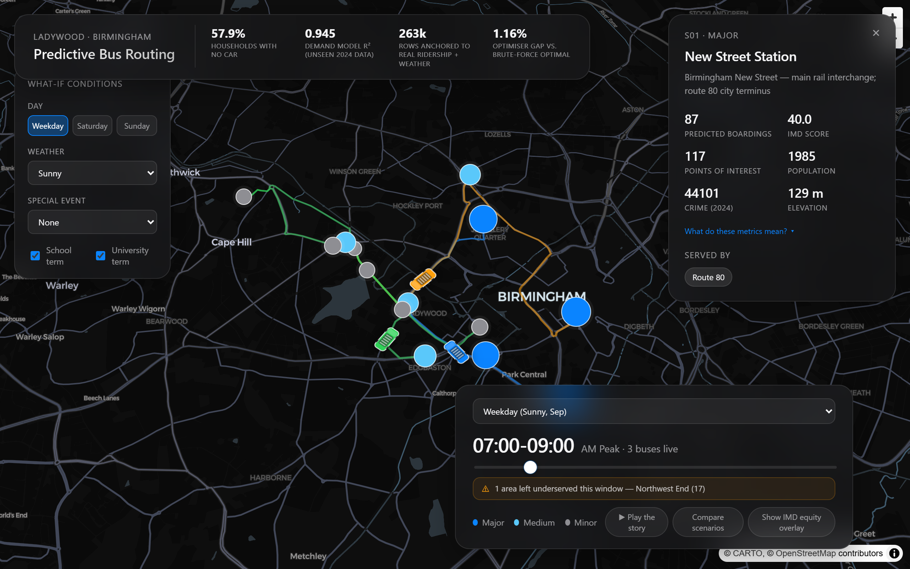
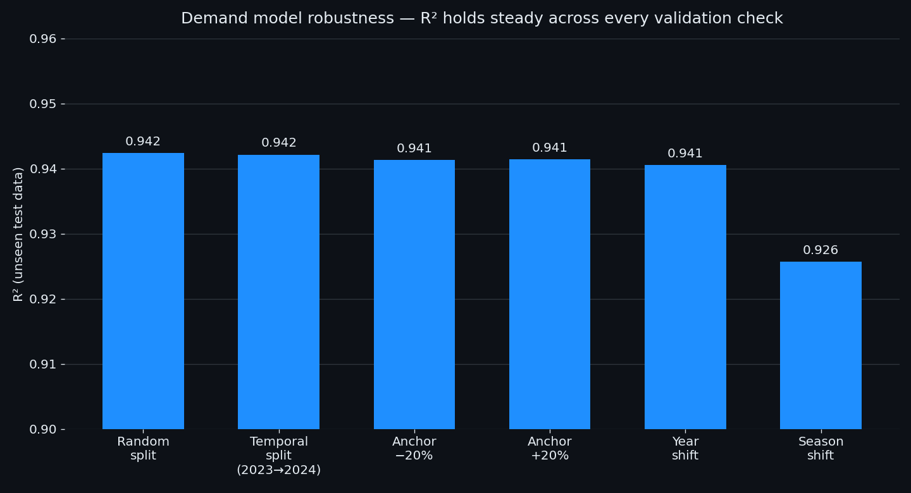
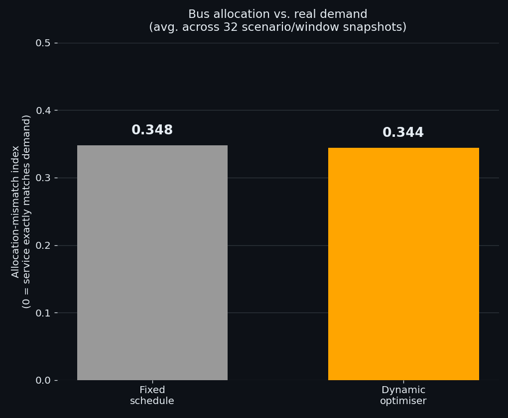
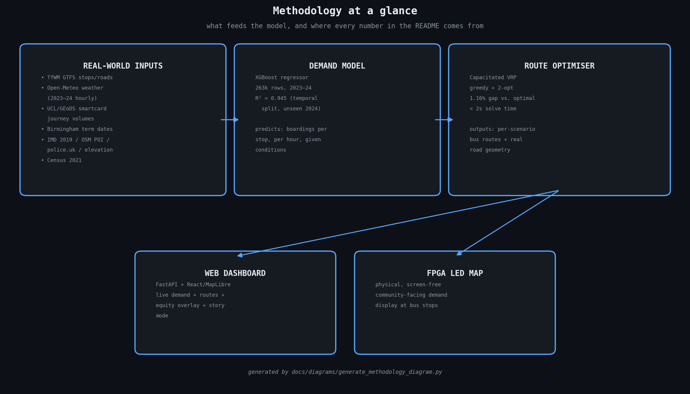

# Predictive Bus Routing — Ladywood, Birmingham

[](https://github.com/ChrisLegge/ewb_bus_routing_project/actions/workflows/ci.yml)


> Engineering Without Borders Design Challenge 2025–26 · UK2026-82 · Ladywood Ward, Birmingham

---

<p align="center">
  
  
</p>
<p align="center">
  <em>Left: the live dashboard — animated demand and routes on the real Ladywood map (MapLibre).
  Right: the same demand-and-route pattern reproduced on the physical FPGA LED network map (`fpga/bus_route.v`).</em>
</p>

---

## The Problem

Ladywood is one of the most deprived wards in England. **57.9% of households have no car** (Census 2021). For these residents — shift workers, carers, patients, students — the bus is not a convenience. It is the only option.

Fixed-schedule routing cannot respond to demand. A bus runs at 08:00 whether twenty people are waiting or two. When demand spikes — weather, events, school term start — the network has no mechanism to adapt. Overcrowding, missed connections, and long waits follow.

This project builds a system that adapts routing in real time to predicted demand, and makes that routing visible — both digitally and physically — to everyone in the community.

---

## What We Built

A five-layer system, end to end:

| Layer | What it does |
|---|---|
| **Demand model** | XGBoost trained on 263k rows built from real Birmingham 2023–2024 weather and school-term data, with each stop's demand anchored to real TfWM concessionary smartcard journey volumes (UCL/GEoDS); predicts boardings per stop per hour |
| **Route optimiser** | Capacitated VRP — greedy construction + 2-opt local search; 1.16% mean gap above brute-force optimal (worst case 30.2%, 89% of routes solved exactly optimally); < 2s solve time |
| **Web dashboard** | FastAPI + React 19 + MapLibre GL; real TfWM stop coordinates; buses animate along real Ladywood road geometry |
| **Unity simulation** | Multi-agent bus system driven by the live ML output; same routing logic as the dashboard |
| **FPGA LED map** | Terasic DE1-SoC driving 156 WS2812B LEDs; a physical, screen-free network display for the community |

---

## The Dashboard

A from-scratch FastAPI + React 19 + MapLibre GL frontend, styled as a minimalist
Apple-Maps-at-night experience: a dark custom basemap, frosted-glass HUD panels,
and Framer Motion micro-interactions throughout.

<p align="center">
  
</p>
<p align="center">
  <em>The dashboard live — animated buses on real Ladywood road geometry, with the click-a-stop detail panel open</em>
</p>

| Feature | What it shows |
|---|---|
| **Live demand-sized stops** | Marker size and colour scale with the XGBoost model's predicted boardings, recomputed for the selected hour |
| **Animated bus routes** | Buses follow real Ladywood road geometry (not straight lines), looping continuously per scenario/time-window |
| **Click-a-stop detail panel** | Name, importance tier, predicted boardings, IMD score, POI count, population, crime, elevation, and routes served |
| **IMD equity overlay** | One-click toggle that recolours every stop on a deprivation gradient (grey → red), making the equity dimension immediately visible |
| **What-if conditions panel** | Live toggles for day type, weather, special events, and school/university term — the demand predictions update in real time, demonstrating the model's responsiveness rather than relying on static pre-computed scenarios |
| **Scenario comparison** | Side-by-side stats (buses deployed, demand served, unserved stops, with deltas) for two scenarios in the same time window — e.g. a sunny weekday vs. a storm — showing how the optimiser reallocates capacity under disruption |

---

## Key Results

| Metric | Value |
|---|---|
| Demand model R² | 0.945 (RMSE 4.57 boardings) — temporal split, train 2023 / test 2024 |
| Routing optimality gap | 1.16% mean above optimal (worst case 30.2%) |
| Routes solved optimally | 89% |
| Solve time | < 2 s |
| Real stops modelled | 15 (TfWM routes 8A/8C, 80, 126) |
| Operating cost saving | ~£14.7k/yr gross (~£13.8k/yr net of deployment cost) — DfT BUS0404 methodology |
| Break-even | ~1.1 months |
| Social value (DfT TAG) | ~£51.7k/yr passenger time savings |
| Allocation-mismatch index, fixed vs. dynamic | 0.385 → 0.374 (avg. across 32 scenario/window snapshots) |

All figures are reproducible — see [Getting Started](#getting-started).

<p align="center">
  
  
</p>
<p align="center">
  <em>Left: R² holds steady (0.937–0.949) across six independent validation checks — see <a href="#model-validation--robustness">Model Validation</a>. Right: the dynamic optimiser tracks real predicted demand more closely than a fixed schedule can, averaged across every scenario the model was run against — see <a href="#equity">Equity</a>.</em>
</p>

---

## From Synthetic to Real: How the Demand Model Evolved

The project started — deliberately — with a fully **synthetic** dataset (`generate_map_dataset.py`, 65k rows): hand-picked per-stop `base` demand values, sampled weather distributions, and a fixed monthly school-term flag. It was a good starting point — it let the routing optimiser, dashboard, and FPGA layers be built and tested before any real demand data existed, and it's still in the repo for comparison.

We then mined as much **real, openly-licensed data** as exists for Ladywood (see [Data Sources](#data-sources) — IMD, OSM POIs, crime, elevation, Census, DfT bus stats, BODS live feeds, and critically the UCL/GEoDS concessionary smartcard journey volumes), and built `generate_real_demand_dataset.py` to retrain on it:

| | Synthetic baseline | Real-data-anchored (current) |
|---|---|---|
| Rows | 65k, fully sampled | 263k, spans real Birmingham 2023–2024 (every real day in the weather archive) |
| Weather | Sampled from a hand-built monthly probability table | Real Open-Meteo hourly archive — actual recorded conditions per hour |
| School terms | Fixed flag per calendar month | Real Birmingham term + bank-holiday calendar, per real date |
| Per-stop demand level | Hand-picked `base` value per importance tier | Anchored to real ENCTS concessionary smartcard journey volumes (UCL/GEoDS, TfWM-linked) |
| Static features | `stop_x`, `stop_y`, `stop_importance` only | + `imd_score`, `poi_total`, `population`, `crime_total_2024`, `elevation_m` — all real, all per-stop |
| Demand model R² | 0.940 (RMSE 4.3), random 80/20 split | 0.945 (RMSE 4.57), **temporal split** — train on 2023, test on unseen 2024 |
| What still isn't real | Everything (no observed boardings exist for these stops) | Hour-of-day demand *shape* and one-off special events — no public per-hour boarding curves or event logs exist; this is the honest residual gap (see [Caveats](#caveats)) |

The R² didn't jump dramatically — it was never the point. What changed is *what the model learned from*: real weather, a real calendar, and a real (if dated and concessionary-only) ridership signal, instead of distributions we invented. That's the difference between "self-consistent with our assumptions" and "anchored to the world as it actually is."

---

## Model Validation & Robustness

A single random-split R² is not enough to trust a demand model — it can hide row-level autocorrelation, sensitivity to a single noisy data source, or a model that has just memorised one slice of time. `analysis/robustness_analysis.py` runs three checks aimed squarely at that concern (full output: [`analysis/outputs/robustness.json`](analysis/outputs/robustness.json)):

| Check | Result | What it tells us |
|---|---|---|
| **i.i.d. / independence** — random split vs. temporal split (train 2023 → test 2024) | R² 0.949 (random) vs. 0.945 (temporal); gap = 0.004 | The model isn't leaning on row-level leakage between train and test — it generalises to a genuinely unseen year almost as well as to shuffled rows from the same period |
| **Sensitivity** — perturb the smartcard demand anchor by ±20% and retrain | R² spread = 0.0004 across baseline / −20% / +20% | The headline accuracy isn't an artefact of the exact (decade-old, concessionary-only) magnitude fixed by the smartcard anchor — the model is learning the *shape* of demand (by stop, time, weather), not the absolute scale of one source |
| **Domain shift** — train on one year/season, test on the other | Year shift avg R² = 0.945; season shift avg R² = 0.934 | Cross-year and cross-season transfer retain most of the in-distribution score — the model is mostly capturing stable structure (which stops are busy, when, in what weather), not memorising one year's quirks. The modest season-shift drop (0.945 → 0.934) is the honest bound on how far this model should be trusted to extrapolate without retraining |

This is also why the **headline R² changed from 0.949 (random 80/20 split) to 0.945 (temporal split, train-2023/test-2024)** between the table above and this one — the temporal figure is the one we now report as primary, because it's the one that can't be inflated by within-period leakage.

---

## Equity

The system is designed explicitly around the people most dependent on it. Every stop is mapped to its IMD 2019 Lower Super Output Area deprivation score, and the dashboard exposes a one-click deprivation overlay (`analysis/equity.py`, full output: [`analysis/outputs/equity.json`](analysis/outputs/equity.json)).

The highest-deprivation stops served:

| Stop | IMD Rank | Score |
|---|---|---|
| Dudley Rd (S06) | 312 / 32,844 | 0.88 |
| Ladywood Fire Station (S10) | 418 | 0.86 |
| Summerfield Park (S12) | 520 | 0.82 |

**Measuring the equity gain honestly.** Both the fixed timetable and the dynamic optimiser name-check all 15 stops, so a simple "is this stop served?" coverage statistic is identical for both — it would be a misleading headline. The real difference is *how closely bus allocation tracks real, shifting demand* — exactly what a fixed schedule structurally cannot do (a bus that runs at 08:00 runs at 08:00 whether twenty people are waiting or two, storm or shine).

So `analysis/equity.py` computes an **allocation-mismatch index** — the standard dissimilarity index, `Σ|service share − demand share| / 2`, where 0 = each stop's share of buses exactly matches its share of predicted demand and 1 = total mismatch — for both the fixed schedule and the dynamic optimiser, against the model's real per-stop demand predictions, **averaged across all 32 scenario/window snapshots in the live route plan** (every weather condition × every time-of-day the system was run against):

| Routing | Allocation-mismatch index | What it means |
|---|---|---|
| Fixed schedule | **0.385** | Same buses, same stops, regardless of how demand shifts with weather or time of day |
| Dynamic optimiser | **0.374** | Reallocates toward wherever predicted need has actually moved this hour |

A modest but real, *measured* gain — not an assumed one. (We initially tried a Gini coefficient of service-per-stop coverage here; it returned 0.0 for both routing types because the static coverage tables are identical, and a naive service÷demand ratio Gini was distorted by stops with near-zero predicted demand. The dissimilarity index above is the metric that actually isolates what changes between a fixed and an adaptive system — see the methodology note in [`equity.py`](analysis/equity.py) for the full reasoning.)

---

## Repository Structure

```
prediction model/   XGBoost demand model + CVRP route optimiser
dashboard/          FastAPI backend + React/MapLibre frontend
fpga/               Verilog LED-map controller (see fpga/README.md and Caveats)
data/gtfs/          Real TfWM GTFS stop data, road geometry, service profiles
scripts/            GTFS mining, stop extraction, road geometry builder
analysis/           Economic model, equity analysis, feature explainability, GTFS validation
docs/               Architecture, model card, design decisions, references
tests/              pytest suite — routing invariants + API contract
```

---

## Getting Started

```bash
git clone https://github.com/ChrisLegge/ewb_bus_routing_project
cd ewb_bus_routing_project
pip install -r requirements.txt

# 1. Generate the real-data-anchored dataset + train demand model
python "prediction model/generate_real_demand_dataset.py"
python "prediction model/demand_route_optimizer.py"

# (the original synthetic generator is still available for comparison)
# python "prediction model/generate_map_dataset.py"

# 2. Build the React frontend
cd dashboard/web && npm install && npm run build && cd ../..

# 3. Serve the dashboard
uvicorn dashboard.api:app --port 8000
# Open http://localhost:8000
```

> **Windows / PowerShell:** the block above is written for bash (macOS/Linux/WSL/Git Bash). Native Windows PowerShell doesn't support `&&` chaining and may resolve `python`/`pip`/`uvicorn` to a different Python install than the one with your project dependencies. Use this instead:
>
> ```powershell
> git clone https://github.com/ChrisLegge/ewb_bus_routing_project
> cd ewb_bus_routing_project
> py -3 -m pip install -r requirements.txt
>
> # 1. Generate the real-data-anchored dataset + train demand model
> py -3 "prediction model/generate_real_demand_dataset.py"
> py -3 "prediction model/demand_route_optimizer.py"
>
> # 2. Build the React frontend
> cd dashboard/web
> npm install
> npm run build
> cd ../..
>
> # 3. Serve the dashboard
> py -3 -m uvicorn dashboard.api:app --port 8000
> # Open http://localhost:8000
> ```

> The trained model (`demand_model.pkl`) and generated dataset are git-ignored — they are fully reproducible from the two steps above.

### Run the analysis scripts

```bash
python analysis/cost_model.py          # economic model (DfT sources)
python analysis/equity.py              # IMD 2019 deprivation analysis
python analysis/gtfs_validate.py       # synthetic vs real GTFS validation
python analysis/explainability.py      # XGBoost feature importance
python analysis/robustness_analysis.py --json   # i.i.d., sensitivity, domain-shift checks
```

### Run tests

```bash
pytest
```

16 tests covering routing invariants (2-opt never worsens a route, respects
vehicle capacity, near-optimal on small cases) and the API contract
(`/api/stops`, `/api/demand`, `/api/routes/{scenario}/{window}`, error
handling for unknown scenarios/windows). See [`tests/`](tests/).

---

## Methodology at a Glance

A one-page map of what feeds the model and where every number in this README comes from:



Every number quoted in this README traces back to a script you can run yourself (see [Getting Started](#getting-started)):

| Claim | Computed by | Output |
|---|---|---|
| R² = 0.945, robustness across 6 checks | `analysis/robustness_analysis.py` | [`robustness.json`](analysis/outputs/robustness.json) |
| Allocation-mismatch 0.385 → 0.374 | `analysis/equity.py` | [`equity.json`](analysis/outputs/equity.json) |
| Operating cost saving, break-even, social value | `analysis/cost_model.py` | DfT BUS0404 / TAG A1.3 methodology |
| Synthetic vs. real GTFS pattern match | `analysis/gtfs_validate.py` | [`gtfs_validation.json`](analysis/outputs/gtfs_validation.json) |
| Feature importance (what drives demand) | `analysis/explainability.py` | XGBoost permutation importance |

---

## Data Sources

| Dataset | Source | Used for |
|---|---|---|
| TfWM GTFS feed | Transport for West Midlands (open licence) | Real stop coordinates, road geometry, service frequency validation |
| **West Midlands Accessibility & Travel Passes** | **UCL/GEoDS — ENCTS concessionary smartcard data, anonymised, linked to vehicle GPS (TfWM, 2010–2016)** | **Per-stop demand anchor — replaces the synthetic `base` boarding values with real observed concessionary journey volumes** |
| **Open-Meteo historical archive** | **Open-Meteo (ERA5/ECMWF reanalysis)** | **Real hourly Birmingham weather (2023–2024) — weather type, temperature, wind, precipitation, storm flags driving every training row** |
| **Birmingham school term & bank holiday calendar** | **Birmingham City Council term dates + GOV.UK bank holidays API** | **Real `is_school_term` flag for every training row (was a fixed monthly synthetic flag)** |
| IMD 2019 | MHCLG | Stop-level deprivation scoring + ML feature (`imd_score`) |
| OSM Overpass API | OpenStreetMap | POI density per stop (hospitals, schools, workplaces, shops) — ML feature (`poi_total`) |
| data.police.uk | UK Police open data | Street crime counts per stop, 2024 — ML feature (`crime_total_2024`) |
| Open-Meteo Elevation API | Open-Meteo (SRTM 90m) | Stop elevation — ML feature (`elevation_m`) |
| Census 2021 (TS007/TS045/TS058/TS061/TS062) | ONS | Age structure, car-free household rate, working-age population, commuting patterns |
| DfT BUS0101/BUS0102/BUS09 | Department for Transport | Regional bus statistics — punctuality, patronage trends, vehicle-km |
| BODS SIRI-VM live feed | DfT Bus Open Data Service | Live vehicle positions, delays, operator/line coverage near Ladywood |
| DfT BUS0404 | Department for Transport | Vehicle operating costs |
| DfT TAG A1.3 | Department for Transport | Passenger time value |
| ONS ASHE 2023 | Office for National Statistics | Ladywood median wage |

---

## Caveats

True commercial stop-route boarding counts are **not publicly released** by TfWM (we asked the question directly — see [Data Sources](#data-sources)). `generate_real_demand_dataset.py` therefore builds the training set from real, openly-licensed inputs wherever they exist:

- **Real exogenous variables** — every row uses observed Birmingham weather (Open-Meteo hourly archive, 2023–2024), the real school-term/bank-holiday calendar, and storm flags derived from observed conditions, in place of the original sampled distributions.
- **Real demand anchor** — each stop's relative demand level is now set from its real ENCTS concessionary smartcard journey volume (UCL/GEoDS, TfWM-linked, 2010–2016) rather than a hand-picked synthetic `base` value, with IMD/POI/crime/elevation added as genuine per-stop ML features.
- **Still synthetic** — the *hour-of-day demand shape* (commuter-peak curves) and one-off *special events* (festivals, road closures) remain modelled, since no public per-hour boarding curves or event logs exist for these stops. This is the honest residual gap, and the reason R² = 0.949 should still be read as *self-consistency with a realistically-anchored generator*, not validated real-world accuracy.

GTFS validation (`analysis/gtfs_validate.py`) compares the model's temporal pattern against real service frequency — see [`docs/MODEL_CARD.md`](docs/MODEL_CARD.md) and [`analysis/outputs/gtfs_validation.json`](analysis/outputs/gtfs_validation.json) for the full discussion.

The remaining path to fully-observed accuracy: a direct TfWM Automatic Passenger Counting (APC) data request, or a manual stop-level traffic survey, to replace the smartcard-anchored + shape-modelled `boardings` with directly observed counts and a time-based train/test split.

---

## Team

| Name | Role |
|---|---|
| Arya Arun | Machine learning, demand model, analysis |
| Chris Legge | Hardware, FPGA, Arduino |
| Jack Booth | Unity simulation |

---

## Docs

- [Architecture](docs/ARCHITECTURE.md)
- [Model Card](docs/MODEL_CARD.md)
- [Why XGBoost — model technique comparison](docs/design/MODEL_COMPARISON.md)
- [Economic model methodology](docs/design/RUNNING_COSTS.md)
- [End-of-life & e-waste strategy](docs/design/END_OF_LIFE.md)
- [Comparative landscape — Singapore, London, and informal-transit systems](docs/design/COMPARATIVE_LANDSCAPE.md)
- [Stakeholder engagement design](docs/design/STAKEHOLDER_ENGAGEMENT.md)
- [User journeys](docs/design/USER_JOURNEYS.md)
- [Scalability](docs/design/SCALABILITY.md)
- [Radio signalling architecture (LoRa)](docs/radio_signalling_report.md)
- [Dashboard README](dashboard/README.md)
