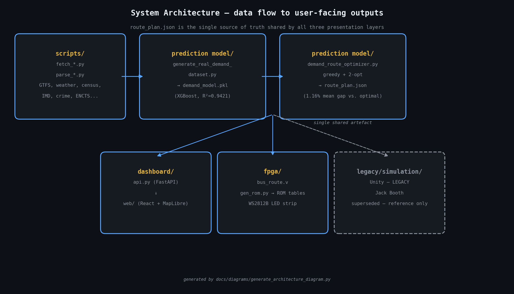

# Architecture

How data flows from raw real-world sources through to the three user-facing
outputs (web dashboard, FPGA LED map, and the legacy Unity simulation). This is the technical
companion to the "Methodology at a Glance" diagram in the main [README](../README.md#methodology-at-a-glance).

## System overview

## Layer 1 — Data ingestion (`scripts/`)

Eleven `fetch_*`/`parse_*` scripts pull and normalise real, openly-licensed data
for Ladywood: TfWM GTFS feeds and live BODS positions, Open-Meteo hourly
weather archive (2023–24), Birmingham school-term calendars, ONS Census 2021,
DfT bus statistics, IMD 2019 deprivation scores, OSM points of interest,
police.uk crime data, elevation, and the UCL/GEoDS ENCTS concessionary
smartcard journey-volume archive (2010–2016). Each script writes a normalised
intermediate file under `data/`. None of these are run at request time — they
are one-off mining steps whose outputs are checked into `data/` so the rest of
the pipeline is reproducible offline. See [Data Sources](../README.md#data-sources)
for the full citation table.

## Layer 2 — Demand model (`prediction model/generate_real_demand_dataset.py` → `demand_model.pkl`)

Builds a 263k-row training table (every real day in the 2023–24 weather
archive × every Ladywood stop × every hour) by joining the ingested sources,
then trains an XGBoost regressor to predict `boardings` per stop per hour.
Static per-stop features (`imd_score`, `poi_total`, `population`,
`elevation_m`) are real (`crime_total_2024` was tested and excluded — see
`analysis/crime_ablation/CRIME_ABLATION.md`, rank 16/20, importance 0.000279);
the demand-shape curve and
special-event modelling remain synthetic (see [Caveats](../README.md#caveats) —
this is the project's most important honesty disclosure and the reason R² is
reported as *self-consistency with a realistically-anchored generator* rather
than validated real-world accuracy).

`predict_window_demand()` is the model's runtime entry point — it's what both
`dashboard/api.py`'s `/api/demand` endpoint and the offline route-plan
generation step call.

## Layer 3 — Route optimiser (`prediction model/demand_route_optimizer.py` → `route_plan.json`)

A capacitated VRP solved with **greedy construction + 2-opt local search**:

1. `greedy_route()` builds an initial route per bus by repeatedly inserting the
   highest-marginal-value unserved stop, respecting `BUS_CAPACITY` (40 passengers)
   and `ROUTE_BUDGET_MIN` (70 minutes one-way).
2. `two_opt()` then locally improves each route by reversing sub-segments
   whenever that shortens total travel time (`path_time()`, computed over the
   real road graph `G` built from TfWM GTFS stop sequences via
   `nx.all_pairs_dijkstra_path_length`).
3. `route_gaps()` benchmarks 2-opt's output against `optimal_path_time()`
   (brute-force permutation search, only tractable for routes ≤ 3 stops) to
   produce the headline **1.16% mean optimality gap** (worst case 30.2%, 89%
   of routes solved exactly optimally — see [Key Results](../README.md#key-results)).

This runs offline across all `SCENARIO_DAYS × TIME_WINDOWS` combinations (4
scenarios × 8 time windows = 32 snapshots) and writes the full result to
`prediction model/route_plan.json`. Both the dashboard and the FPGA ROM
generator consume this single artefact — there is exactly one source of truth
for "what does the optimised network look like."

## Layer 4a — Web dashboard (`dashboard/api.py` + `dashboard/web/`)

A FastAPI backend (`dashboard/api.py`) exposes five endpoints:

| Endpoint | Purpose |
|---|---|
| `GET /api/stops` | Real TfWM stop coordinates + metadata |
| `GET /api/roads` | Road geometry for route animation |
| `GET /api/demand` | Live call into `predict_window_demand()` — the only endpoint that runs the model at request time, powering the "what-if conditions" panel |
| `GET /api/scenarios` | Available pre-solved scenario names |
| `GET /api/routes/{scenario}/{window}` | Pre-solved route plan for a given scenario/window, read from `route_plan.json` |

The frontend (`dashboard/web/`, React 19 + Framer Motion + MapLibre GL) renders
this over a custom dark basemap with animated buses following real road
geometry, click-to-inspect stop panels, an IMD equity overlay, scenario
comparison, and a guided "story mode" walkthrough (`StoryOverlay`/`story.ts`).

## Layer 4b — FPGA LED map (`fpga/bus_route.v`, generated by `gen_rom.py`)

A static, physical visualisation for the DE1-SoC board: `gen_rom.py` (not yet
committed to this repo — see [Caveats](../README.md#caveats)) reads
`route_plan.json` and bakes its contents into Verilog `case`-statement ROM
tables (`route_stop_led`, `demand_rom`, `path_rom`, etc.), which a WS2812B
bit-bang driver renders onto a 156-LED strip. **This is a snapshot display, not
a live system** — see [`fpga/README.md`](../fpga/README.md) for the full design
review (including a real timing-closure issue found in Quartus's STA report)
and [`docs/radio_signalling_report.md`](radio_signalling_report.md) for a
proposed architecture to make it live via LoRa radio.

## Layer 4c — Unity simulation — LEGACY (`legacy/simulation/`, Jack Booth)

A multi-agent 3D visualisation built early in the project, driven by the same
`route_plan.json` / ML-output pathway, communicating with hardware over an
Arduino serial bridge. **It now lives under `legacy/` and is no longer an
active presentation layer** — the web dashboard and FPGA LED map have
superseded it as the project's two live, maintained outputs. It's retained in
the repo for reference and because Jack Booth's underlying multi-agent
approach is sound; see the simulation's own README under
`legacy/simulation/` for details on what it does and how to run it.

## Why this shape?

The single most important architectural decision is that **`route_plan.json`
is the one shared artefact** between the presentation layers — including the
now-legacy Unity simulation, which read from the same source as the two active
outputs while it was maintained. The demand model and optimiser run once,
offline, across every scenario/window combination; the dashboard and FPGA ROM
generator both read from (or, for the dashboard's live demand panel,
re-derive from the same model as) that one file. This guarantees the active
outputs can never silently diverge — if the numbers on the dashboard and the
LEDs ever disagree, it can only be because one of them is stale, which is a
straightforward regenerate-and-redeploy fix rather than a logic bug to hunt
across codebases.
