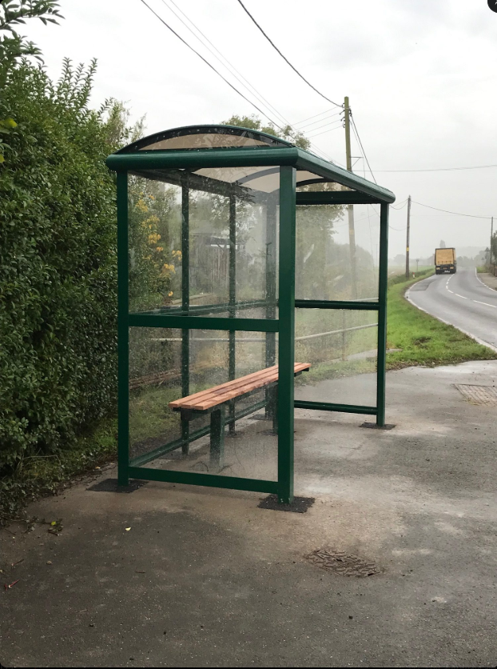
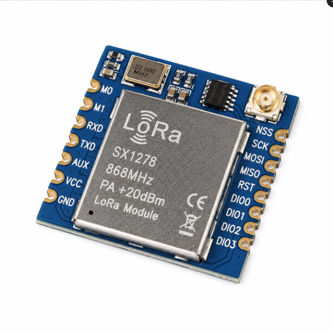
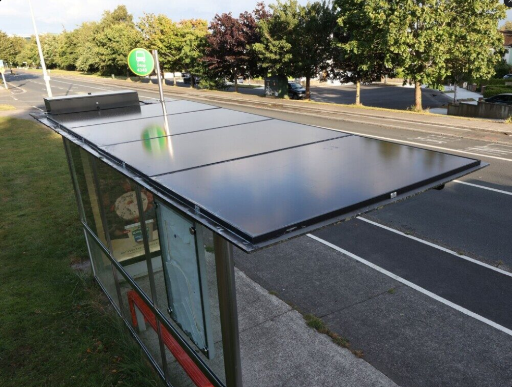

# Live Hub-to-Stop Signalling: A LoRa Radio Architecture for the FPGA Demand Display

*A proposed next phase for the FPGA LED bus-stop display — turning the current static demo into a live, hub-broadcast system.*

## 1. The problem

The current FPGA LED map (see [`fpga/`](../fpga/)) animates buses and demand patterns from **pre-baked ROM tables** generated once from `route_plan.json`. It looks great as a community-facing demo, but it has no live data link — it can't reflect a route that has just been re-optimised in response to changing conditions (weather, an event, a service disruption). This report sketches how a real deployment would close that gap: a central hub broadcasting live route/demand updates by radio to small, low-power receiver units mounted at each bus stop.



## 2. Why radio, and why LoRa specifically

Three signalling options were considered:

| Option | Range | Power | Cost/unit | Verdict |
|---|---|---|---|---|
| Wi-Fi | ~50 m indoors | High (needs mains) | Low | Needs infrastructure (router) at every stop — impractical |
| Bluetooth / BLE | ~10–100 m | Low | Low | Range far too short for hub-to-many-stops |
| **LoRa (433 MHz)** | **Hundreds of metres – several km** | **Very low (battery/solar viable)** | **~£15–20** | **Best fit** |

LoRa (Long Range radio, e.g. the Semtech SX1278 chipset) trades data rate for range and power efficiency — it's slow (kilobits per second) and high-latency, which usually rules it out for real-time telemetry. **That trade-off doesn't matter here**: route/demand data updates on the scale of minutes to hours (per scenario/time-window), not milliseconds. A tiny periodic packet — "stop S04: demand=high, next bus ETA=4 min, route colour=amber" — is exactly the payload LoRa was designed to carry.



## 3. Proposed architecture

```
 ┌──────────────────────────┐        433 MHz         ┌──────────────────────────┐
 │   CENTRAL HUB            │   ───── LoRa TX ─────▶ │   STOP UNIT (× N)        │
 │  Route optimiser +       │                        │  LoRa RX (UART)          │
 │  FastAPI backend         │                        │  → microcontroller/FPGA  │
 │  (existing system)       │   ◀──── ack/telemetry ─│  → drives WS2812B LEDs   │
 └──────────────────────────┘     (optional)         └──────────────────────────┘
```

- **Hub**: the existing route-optimiser/backend gains a small broadcast service — every time a scenario re-solves (e.g. conditions change, or on a fixed cadence), it pushes a compact packet per stop (or a batched packet covering all stops on one route) out over a LoRa transmitter attached via UART/SPI.
- **Stop unit**: a small low-power receiver (LoRa module + microcontroller, or feeding straight into the FPGA's UART pins) decodes the packet and updates the LED display accordingly — no change needed to the WS2812B driving logic already proven in `fpga/bus_route.v`, just a new data source replacing the static ROM lookup.
- **Mesh option**: modules such as the DFRobot LoRa MESH variant can relay packets stop-to-stop, extending the hub's effective reach past line-of-sight without extra infrastructure — useful in a built-up area like Ladywood where buildings would otherwise block a direct hub→stop link.


## 4. Power and practicality

A genuine strength of this approach: **no mains wiring required at each stop**. SX1278-class modules draw very little current, run off 1.8–3.6 V, and pair naturally with a small battery + solar trickle-charge — the kind of self-contained unit that could realistically be retrofitted onto an existing bus-stop post without civil works.



## 5. What this would change for the FPGA design

Critically, **this requires no rework of the WS2812B driving logic** already built and reviewed in `fpga/bus_route.v` — `cur_color`, the bit-bang FSM, and the bus-animation state machines stay as-is. The only change is the *data source*: instead of selecting a row from an auto-generated ROM table via switches (`SW[1:0]`/`SW[4:2]`), the design would read the same shape of data (stop demand levels, active route) from a UART register fed by the LoRa receiver. This is a clean, additive next phase rather than a redesign.

## 6. Honest limitations to flag

- **Latency**: LoRa packets take longer to transmit than Wi-Fi/Bluetooth — fine for "demand updates every few minutes," not for "exact live bus position to the metre."
- **Urban range**: the "several km" figures are open-air; buildings and street furniture in a dense urban area like Ladywood will reduce effective range — a mesh topology (§3) mitigates this.
- **Regulatory**: 433 MHz is a licence-free ISM band in the UK, but transmit duty-cycle and power limits apply (typically <10% duty cycle, ≤10 mW ERP in the relevant sub-band) — any real deployment would need to design the broadcast schedule around these limits.

## 7. Suggested next step

A small bench prototype: one LoRa transmitter on a Raspberry Pi (standing in for the hub backend) broadcasting a mock "stop demand" packet, and one receiver feeding a microcontroller driving a handful of WS2812B LEDs (standing in for a stop unit). This would prove the data path end-to-end before any integration with the full FPGA design — and would make for a compelling "here's the live version, in progress" demo addition alongside the existing static FPGA display.

---

### Image list (for you to source and drop into `images/`)

| # | Filename used above | What to look for |
|---|---|---|
| 1 | `01-bus-stop-context.jpg` | Photo of a UK-style bus stop/shelter — sets the scene |
| 2 | `02-lora-module.jpg` | Product photo of an SX1278 / Ra-01 LoRa module (search "SX1278 Ra-01 LoRa module 433MHz") |
| 3 | `03-coverage-diagram.jpg` | A LoRa/mesh network coverage diagram (search "LoRa mesh network diagram" — vendor sites like DFRobot/Quectel often have clean ones) or a simple hub-and-spoke map graphic |
| 4 | `04-solar-power-unit.jpg` | Photo of a solar-powered roadside sensor/bus-stop lighting unit (search "solar powered bus stop sensor") |

Use royalty-free sources (vendor product pages, Wikimedia Commons, Unsplash/Pexels) and keep attribution notes if the licence requires it.
